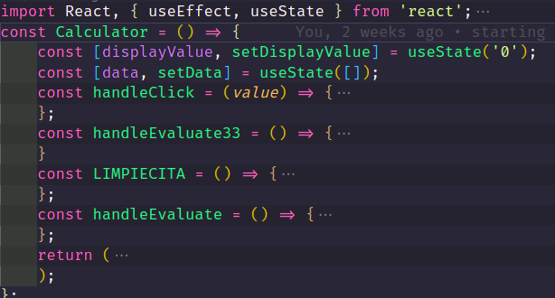
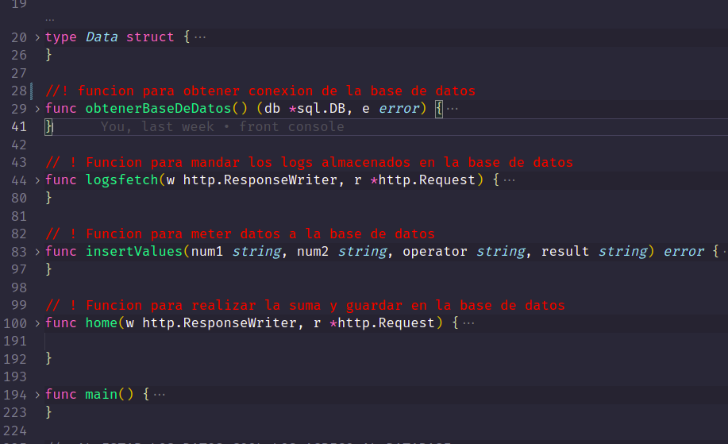
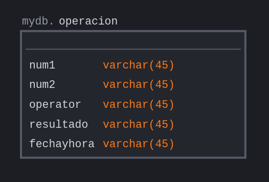
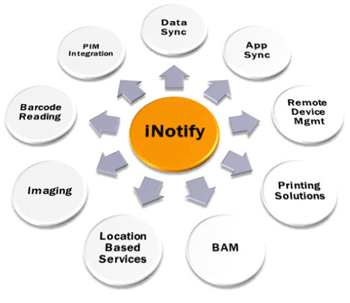

UNIVERSIDAD DE SAN CARLOS DE GUATEMALA

FACULTAD DE INGENIERIA

ESCUELA DE CIENCIAS Y SISTEMAS

SISTEMAS OPERATIVOS 1

PRIMER SEMESTRE 2023

---

---

---

---

---

---

---

 <h1>PRACTICA #1</h1> 

<!-- 
 <h1>CALCULADORA</h1> 
 -->

---

---

---

---

| Nombre   |      Carnet      |  
|----------|:-------------:|
| Alvaro Emmanuel Socop Pérez | 202000194 | 

---

---

---

---

---

---

---

---

---

# MANUAL TECNICO

>“Programa Orquestado en Docker-compose.”
## ÍNDICE
| Topico | Link |
| ------ | ------ |
| Introducción | [Ir](#intro) |
| Objetivos y alcances del sistema| [Ir](#ob) |
| Componentes utilizados | [Ir](#sis) |
| Sistema Operativo | [Ir](#sis) |
| Tecnologías utilizadas | [Ir](#tech) |
| Interfaz del programa | [Ir](#inter) |
| Conclusiones | [Ir](#Conclu) |

# Calculadora Básica Orquestado en Docker-Compose

## INTRODUCCIÓN

Esta documentación describe la implementación de una aplicación de calculadora básica utilizando React para la interfaz de usuario, Golang para el back-end, y MySQL para almacenar los registros de operaciones. Además, se utilizó Docker Compose para orquestar la aplicación y se creó un contenedor en Alpine para ejecutar un script que muestra los reportes solicitados.

## Objetivos

El objetivo de esta aplicación es proporcionar una herramienta de cálculo básica para los usuarios, mientras que también demuestra la utilización de diversas tecnologías de desarrollo de software. Específicamente, los objetivos de la aplicación son:

- Crear una aplicación de calculadora básica utilizando React y Golang
- Conectar la aplicación de React con el back-end de Golang
- Almacenar los registros de operaciones en una base de datos MySQL
- Orquestar la aplicación con Docker Compose
- Crear un contenedor en Alpine para ejecutar un script que muestra los reportes solicitados

## Componentes utilizados

La aplicación de calculadora básica se compone de varios componentes, cada uno de los cuales se describe a continuación:

### React
React se utiliza para crear la interfaz de usuario de la calculadora la cual realiza operaciones aritméticas simples (+, -, *, /) en tiempo real en función de los botones que se presionan. Además, guarda un registro de todas las operaciones realizadas y su resultado utilizando una API RESTful.

La calculadora tiene dos estados, displayValue y data. displayValue almacena el valor actual que se muestra en la pantalla de la calculadora. data es una matriz que almacena los registros de las operaciones realizadas. Cada vez que se realiza una operación, el resultado se agrega a la matriz data.

- handleClick se llama cada vez que se presiona un botón en la calculadora. Si se presiona un número o un punto decimal, se agrega al final del valor actual en displayValue. Si se presiona un operador (+, -, *, /), se actualiza displayValue con el operador y se guarda el número actual en la variable numin1. Si se presiona el botón de igualdad (=), la función handleEvaluate se llama para evaluar la expresión actual en displayValue.

- handleEvaluate primero comprueba si la expresión actual es una expresión matemática válida utilizando una expresión regular. Si es válida, se realiza la operación correspondiente utilizando la API RESTful. Si la operación es una división por cero, se emite una alerta.

- handleEvaluate también actualiza el estado de la matriz data para incluir la nueva operación realizada. Luego, la función handleEvaluate actualiza displayValue con el resultado de la operación y llama a la función setData para actualizar data.

Por último, la calculadora renderiza la pantalla de la calculadora y una tabla con los registros de las operaciones realizadas en la matriz data.

### Golang

Se creo el back-end de la aplicación de calculadora básica. En este caso, se utiliza para procesar las solicitudes del usuario y realizar los cálculos correspondientes.

- type Data struct: Define una estructura para almacenar los resultados de las operaciones.

- obtenerBaseDeDatos(): Función que devuelve una conexión a la base de datos MySQL.

- logsfetch(w http.ResponseWriter, r *http.Request): Función que consulta la tabla "operacion" de la base de datos y devuelve los resultados en formato JSON.

- insertValues(num1 string, num2 string, operator string, result string): Función que inserta los valores de una operación en la base de datos.

- home(w http.ResponseWriter, r *http.Request): Función que recibe los valores de la operación, realiza la operación aritmética y guarda el resultado en la base de datos. Esta función se utiliza para realizar la suma, resta y multiplicación de dos números. Si se intenta dividir por cero, se registra la operación en la base de datos y no se realiza la división.

### MySQL

Utilizado para almacenar los registros de operaciones de la aplicación de calculadora básica.

La siguiente declaración "CREATE TABLE mydb.operacion" crea una nueva tabla llamada "operacion" en el esquema "mydb". La tabla "operacion" tiene cinco columnas:

- "num1":  representa el primer número de la operación matemática.
- "num2":  representa el segundo número de la operación matemática.
- "operator":  representa el operador matemático utilizado en la operación.
- "resultado":  representa el resultado de la operación matemática.
- "fechayhora":  representa la fecha y hora en que se realizó la operación.

### Alpine

Alpine es una distribución de Linux que se utiliza para crear el contenedor que ejecuta el script que muestra los reportes solicitados. Es conocida por su tamaño pequeño y su seguridad mejorada.

El script que se ejecuta en Alpine dentro de Docker está haciendo uso de una herramienta llamada inotify, que permite monitorear eventos en un sistema de archivos. En particular, el script está usando inotifywait, un comando que se usa para esperar por eventos en un archivo o directorio específico.

En este caso, el script está monitoreando el archivo logs.txt para detectar cualquier cambio en el archivo. Cuando ocurre un cambio, se ejecuta una acción, en este caso la acción es leer y mostrar el contenido del archivo en la terminal. Esta acción se repite en un ciclo continuo, lo que significa que el script estará constantemente verificando si hay algún cambio en el archivo logs.txt.

Esta técnica de monitoreo de archivos se utiliza comúnmente en aplicaciones que generan registros o logs, ya que permite a los desarrolladores monitorear de cerca los eventos que ocurren en la aplicación. Al usar esta herramienta, los desarrolladores pueden detectar rápidamente cualquier problema que pueda surgir en la aplicación y solucionarlo de manera efectiva.

### Docker Compose

Docker Compose es una herramienta utilizada para orquestar la aplicación de calculadora básica. Permite definir y ejecutar varios contenedores de Docker en conjunto.

## Conclusiones

La aplicación de calculadora básica con React, Golang, MySQL y Docker Compose es una excelente demostración de cómo se pueden utilizar varias tecnologías juntas para crear una aplicación funcional y moderna. Al utilizar estas herramientas y tecnologías, se pueden construir aplicaciones más robustas y escalables. Además, el uso de contenedores de Docker hace que la implementación y el despliegue de la aplicación sean más sencillos y eficientes.

## Anexos
