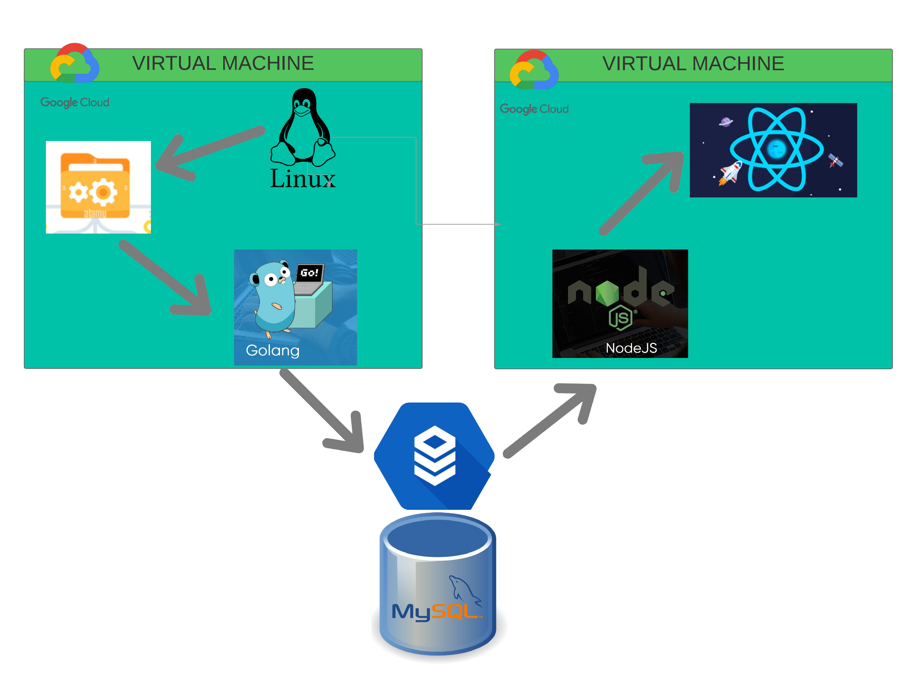
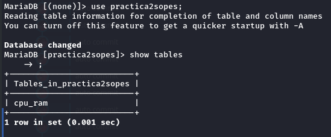
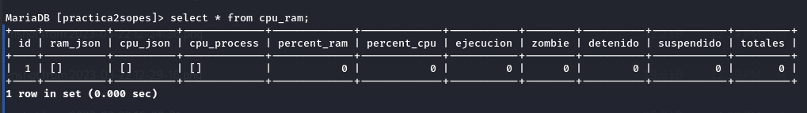
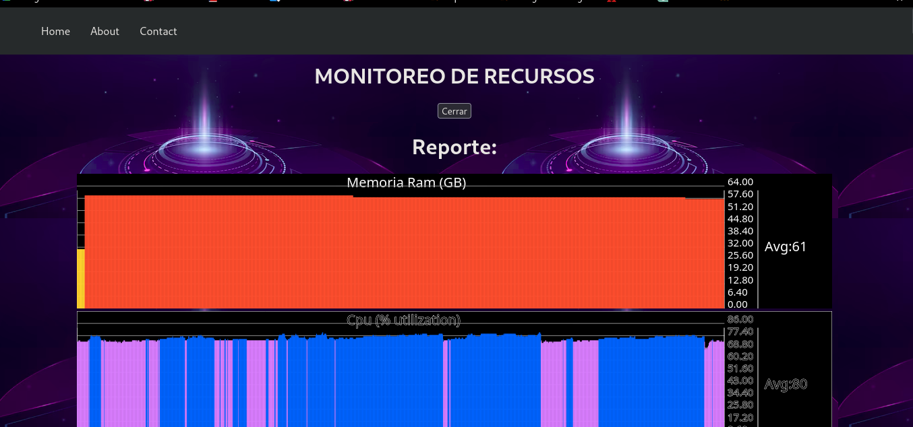
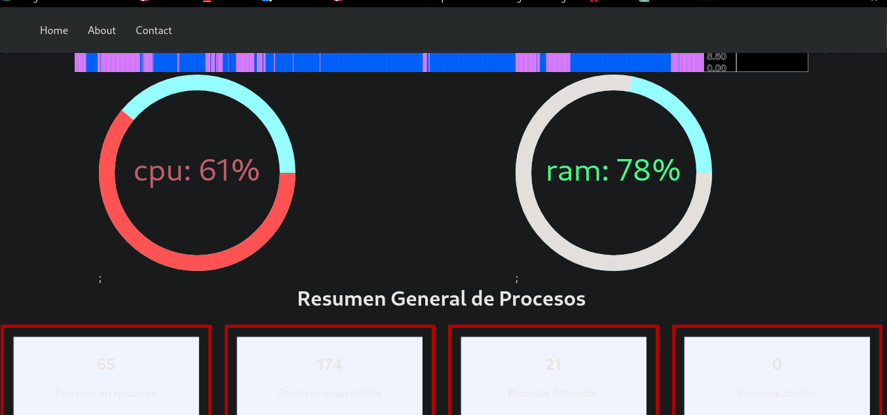
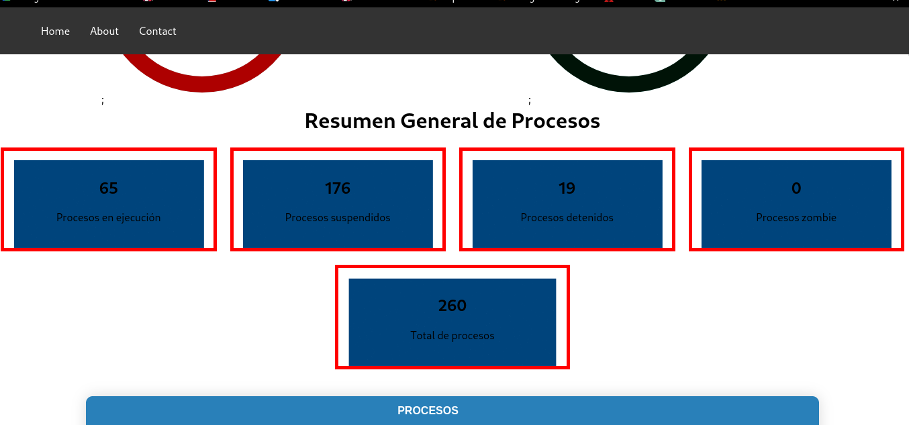
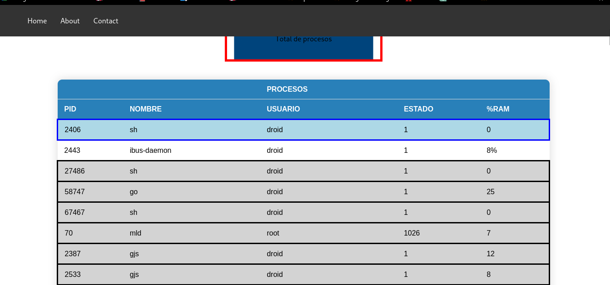

<p>UNIVERSIDAD DE SAN CARLOS DE GUATEMALA</p>
<p>FACULTAD DE INGENIERIA</p>
<p>ESCUELA DE CIENCIAS Y SISTEMAS</p>
<p>SISTEMAS OPERATIVOS 1</p>
<p>PRIMER SEMESTRE 2023</p>

---


---


---


---


---


---


---

<center> <h1>PRACTICA #2</h1> </center>


---


---


---


---


| Nombre   |      Carnet      |
|----------|:-------------:|
| Alvaro Emmanuel Socop Pérez | 202000194 |

---


---


---


---


---


---


---


---


---

# <a name="nothing"></a>MANUAL TECNICO


>“Programa Orquestado en Docker-compose.”
## <a name="intro" ></a>ÍNDICE
| Topico | Link |
| ------ | ------ |
| Introducción | [Ir](#intro) |
| Objetivos y alcances del sistema| [Ir](#ob) |
| Componentes utilizados | [Ir](#sis) |
| Sistema Operativo | [Ir](#sis) |
| Tecnologías utilizadas | [Ir](#tech) |
| Interfaz del programa | [Ir](#inter) |
| Conclusiones | [Ir](#Conclu) |


# Calculadora Básica Orquestado en Docker-Compose

## <a name="intro" ></a>INTRODUCCIÓN

Esta documentación describe la implementación de una aplicación de MONITOR DE RECURSOS utilizando React para la interfaz de usuario, Golang para el back-end, NodeJS para la api y MySQL para almacenar los registros de los procesos e informacion de la memoria RAM obtenido del Kernel de la maquina la cual se este ejecutando. Además, se utilizó Docker para desplegar la aplicación y se desplego la aplicacion en VM de GCP (Google Cloud Platform) igualmente teniendo la base de datos en la nube.

## Objetivos

- Conocer el kernel de Linux y sus módulos.
- Comprender y utilizar herramientas de Google Cloud Platform.
- Utilizar máquinas virtuales de GCP.
- Creación de módulos.
- Utilizar CloudSQL

## Arquitectura:



## Componentes utilizados

La aplicación de calculadora básica se compone de varios componentes, cada uno de los cuales se describe a continuación:

### React
React se utiliza para crear la interfaz de usuario del dashboard la cual muestra en tiempo real los datos de los procesos del CPU y la RAM.


### Golang

Se creo el back-end de la aplicación de monitoreo de recursos. En este caso, se utiliza para procesar y guardar en la db lo que se encuentra en el archivo /PROC.


### MySQL

Utilizado para almacenar los registros de CPU y RAM.

La siguiente declaración "CREATE TABLE mydb.cpu_ram" crea una nueva tabla llamada "cpu_ram" en el esquema "mydb". La tabla "operacion" tiene 5 columnas:



- "ram_json" (JSON):  representa todos los datos de RAM que se ejecutan a travez del tiempo en la VM.
- "cpu_json" (JSON):  representa todos los datos de CPU que se ejecutan a travez del tiempo en la VM.
- "cpu_process" (JSON): representa todos los procesos que se estan ejecutando en la VM.
- "percent_ram" (int):  representa el valor puntual del porcentaje de memoria RAM utilizado.
- "percent_cpu" (int):  representa el resultado del procesamiento de CPU.
- "ejecucion", "zombie", "detenido", "suspendido" y "totales" : se usaron para el conteo de procesos que se contaron.

## PROCEDIMIENTO DESPLIEGUE EN GOOGLE CLOUD CONSOLE
Para desplegar una API en Go en una instancia de Google Cloud, se realizo:

Crea una instancia de Google Cloud: Para crear una instancia de Google Cloud, ve a la consola de Google Cloud y haz clic en "Crear instancia de máquina virtual". Sigue los pasos para crear una instancia y asegúrate de seleccionar una imagen de Go.

Configura el servidor web: Después de crear la instancia, conecta con ella mediante SSH. A continuación, instala un servidor web como Nginx o Apache y configúralo para que sirva la aplicación Go. Asegúrate de que el puerto de la aplicación esté abierto en el firewall de la instancia.

Despliega la aplicación: Sube el código fuente de la aplicación Go a la instancia y compila la aplicación. Después de compilar, ejecuta la aplicación y asegúrate de que está escuchando en el puerto correcto. Puedes usar herramientas como systemd o supervisor para asegurarte de que la aplicación se ejecute de manera continua.

Configura el dominio: Configura un nombre de dominio para tu aplicación y apunta el DNS a la dirección IP de la instancia.

## PROCEDIMIENTO DE DESPLIEGUE EN OTRA INSTANCIA
Para desplegar Docker Compose en otra instancia, se realizo:

Crea una instancia de Google Cloud: Al igual que en el caso anterior, crea una instancia de Google Cloud y asegúrate de seleccionar una imagen de Docker.

Instala Docker y Docker Compose: Conecta con la instancia mediante SSH y asegúrate de que Docker y Docker Compose están instalados.

Crea un archivo Docker Compose: Crea un archivo docker-compose.yml en la instancia y define los servicios que quieres desplegar. Asegúrate de que cada servicio esté configurado correctamente y que los puertos que necesitas estén expuestos.

Ejecuta Docker Compose: Ejecuta el comando docker-compose up para desplegar los servicios. Si todo va bien, deberías poder acceder a los servicios desde su dirección IP o su nombre de dominio.

### Creación de una base de datos en Google Cloud SQL

Para crear una base de datos en Google Cloud SQL, se realizo:

Crea una instancia de Google Cloud SQL: Ve a la consola de Google Cloud y crea una instancia de Google Cloud SQL. Asegúrate de seleccionar el motor de base de datos que necesitas (por ejemplo, MySQL o PostgreSQL).

Configura la instancia: Configura la instancia según tus necesidades, incluyendo la región en la que quieres que esté alojada la instancia, la capacidad de almacenamiento, el tipo de máquina y las opciones de conexión.

Configura la red: Configura la red de la instancia para permitir que las instancias de Google Cloud se comuniquen con la base de datos. Asegúrate de que el firewall de la instancia permita
## INTERFAZ GRAFICA




## COMANDOS PARA INICIAR VM1
```
cd "/home/alvaro24_ingenieria/so1_202000194/Practica2/module"
bash eje.sh
cd "/home/alvaro24_ingenieria/so1_202000194/Practica2/module"
sudo docker build -t practica2_backend . --no-cache
sudo docker run  -p 8080:8080 practica2_backend

```
## COMANDOS PARA INICIAR FRONTEND VM2
```
cd "/home/alvaro24_ingenieria/so1_202000194/Practica2/frontend"
sudo docker-compose up -d

// para construirlo FRONTEND
sudo docker-compose build --no-cache


```

sudo apt-get update
sudo apt-get install -y build-essential
sudo apt-get install -y linux-headers-$(uname -r)
    Instala la última versión del kernel:
sudo apt-get install linux-generic


## Conclusiones

La aplicación de calculadora básica con React, Golang, MySQL y Docker Compose es una excelente demostración de cómo se pueden utilizar varias tecnologías juntas para crear una aplicación funcional y moderna. Al utilizar estas herramientas y tecnologías, se pueden construir aplicaciones más robustas y escalables. Además, el uso de contenedores de Docker hace que la implementación y el despliegue de la aplicación sean más sencillos y eficientes.


## Anexos
