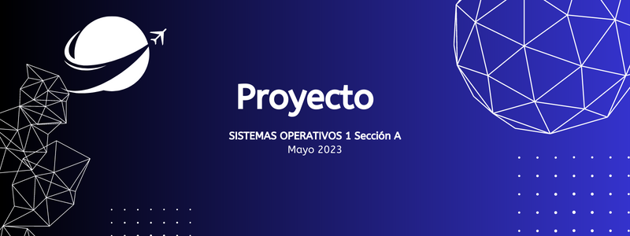

## Manual Técnico

UNIVERSIDAD DE SAN CARLOS DE GUATEMALA

FACULTAD DE INGENIERIA

ESCUELA DE CIENCIAS Y SISTEMAS

---

## Integrantes

| Nombre                        |   Carné   |
| ----------------------------- | :-------: |
| Alvaro Emmanuel Socop Pérez   | 202000194 |
| Sergie Daniel Arizandieta Yol | 202000119 |

---

## Objetivos

### General

El documento tiene como finalidad proporcionar información de manera técnica para todo aquel interesado en la edición o comprensión del código fuente del software con la cual puede conocer el manejo adecuado y correcto que la aplicación necesita para el funcionamiento del mismo, asi como la descripción de las tecnologías aplicadas.

### Específicos

- Otorgar al usuario una explicación simple y concisa de entender todas las características y el diseño de software de forma técnica de la API que posee de manera lógica.
- Entregar al lector los fundamentos teóricos de la API presentado buscando que sea apoyo para la compresión del código base a los fundamentos a presentar en el documento.
- Que todo usuario que utilice o busque optimización y edición de la API sea capaz de cumplirlo entendiendo las bases con la que este funciona. Descripción

---

### Descripción

Se creó un sistema distribuido que mostraba estadísticas en tiempo real mediante Kubernetes y tecnologías en la nube. También se proporcionó un despliegue blue/green, es decir, una división de tráfico de entrada. Este proyecto fue aplicado para llevar el control sobre el porcentaje de votos emitidos en las elecciones.

---

## Requisitos

Docker

Kubernetes

React

GO

Node

Python

MySQL

Redis

Google Cloud

---

## Arquitectura de comunicación

---

## Docker

Docker es una plataforma de software que permite crear, distribuir y ejecutar aplicaciones en contenedores. Un contenedor es una unidad de software que contiene todo lo que una aplicación necesita para funcionar, como el código, las dependencias y la configuración. Los contenedores son aislados y portátiles, lo que significa que se pueden ejecutar en cualquier máquina que tenga Docker instalado, sin importar el sistema operativo o la configuración de hardware.

Para la creación de los contadores se necesita una imagen, las cuales fueron mostradas anteriormente su configuración para la realización de las mismas, están son necesarias debido a que utilizamos diferentes tecnologías según a nuestros fines, pero por lo general para otros servicios docker tiene imágenes listas solo para descargar en Docker Hub: https://hub.docker.com.

---

## Docker Hub

Docker Hub es un servicio de registro de contenedores en línea que permite a los usuarios almacenar y compartir imágenes de contenedores. Las imágenes de contenedores son paquetes autocontenidos que contienen todo lo que una aplicación necesita para funcionar, incluyendo el código, las dependencias y la configuración.

---

## Kubernetes

Kubernetes es una plataforma de orquestación de contenedores de código abierto que ayuda a automatizar la implementación, el escalado y la administración de aplicaciones en contenedores. A continuación se describen brevemente algunos de los componentes clave de Kubernetes:

### Nodos

Los nodos son las máquinas virtuales o físicas que ejecutan las aplicaciones en contenedores en Kubernetes. Cada nodo tiene su propia dirección IP y un conjunto de recursos de hardware, como CPU, memoria y almacenamiento. Los nodos se pueden agregar o eliminar dinámicamente del clúster según sea necesario.

### Pods

más contenedores que se ejecutan en un nodo. Los contenedores dentro de un pod comparten el mismo espacio de red y de almacenamiento, lo que les permite comunicarse entre sí de manera eficiente.

### NameSpaces

Los namespaces son una forma de crear espacios aislados para los objetos de Kubernetes. Cada objeto de Kubernetes, como un pod o un servicio, pertenece a un namespace. Los namespaces ayudan a separar los objetos en diferentes entornos, como producción y desarrollo.

### Servicios

Los servicios en Kubernetes son una abstracción que se utiliza para exponer un conjunto de pods como un servicio de red. Los servicios se utilizan para permitir que los pods se comuniquen entre sí y con el mundo exterior.

En Kubernetes, hay tres tipos de servicios:

- ClusterIP: El servicio se expone solo dentro del clúster Kubernetes. Solo se puede acceder al servicio a través de la dirección IP interna del clúster.

- NodePort: El servicio se expone en un puerto estático en cada nodo del clúster Kubernetes. Cada nodo reenvía el tráfico al servicio en el clúster.

- LoadBalancer: El servicio se expone a través de un equilibrador de carga externo. El equilibrador de carga distribuye el tráfico a través de los nodos del clúster.

### Recursos

En Kubernetes, los recursos se definen como unidades de capacidad informática, como la CPU y la memoria, que están disponibles en los nodos del clúster. Los recursos se pueden asignar a los pods para garantizar que tengan suficiente capacidad para ejecutar sus aplicaciones. Kubernetes también puede hacer un seguimiento del uso de recursos y ajustar automáticamente la asignación para garantizar un rendimiento óptimo.

Ingress es un recurso de Kubernetes que se utiliza para exponer servicios HTTP y HTTPS en el clúster Kubernetes. Ingress actúa como un proxy de nivel de aplicación que enruta el tráfico de entrada a los servicios correspondientes en el clúster. Ingress puede ser configurado para realizar acciones como equilibrar la carga, autenticación y autorización, y enrutamiento basado en nombres de host y rutas.

---

## Sofwares a dockerizar:

### GRPC Cliente

Este código es un cliente gRPC escrito en JavaScript que interactúa con un servidor gRPC utilizando el archivo voto.proto que define los servicios y mensajes que se utilizarán para comunicarse con el servidor.

El código utiliza el módulo express para crear una aplicación web, define algunas rutas y usa el middleware cors para permitir solicitudes cruzadas. Además, se utiliza el módulo dotenv para cargar variables de entorno desde un archivo .env.

El cliente gRPC se crea a partir del archivo voto.proto utilizando el módulo @grpc/proto-loader para cargar el archivo y @grpc/grpc-js para crear el cliente en sí. Se define una dirección y puerto de destino para el cliente gRPC, que puede ser pasado como argumento o leído desde una variable de entorno. Luego se crea una instancia del cliente utilizando la dirección y puerto de destino y se usan los servicios definidos en el archivo voto.proto para interactuar con el servidor gRPC.

La aplicación web tiene tres rutas:

La ruta raíz (/) devuelve un mensaje de bienvenida.
La ruta /NewMessage es una solicitud POST que recibe un objeto de datos de voto, que luego se pasa al servicio AddVoto del cliente gRPC para agregar el voto al servidor.
La ruta /listar-voto es una solicitud GET que llama al servicio ListarVotos del cliente gRPC y devuelve una lista de votos obtenidos del servidor.
Por último, la aplicación se inicia en el puerto 4000 y se imprime un mensaje de confirmación en la consola.

### GRPC Server

Este es un ejemplo de servidor gRPC en Node.js. El servidor implementa dos métodos remotos definidos en el archivo voto.proto.

El primer método es AddVoto, que inserta un registro de voto en la base de datos. El segundo método es ListarVotos, que devuelve una lista de todos los votos registrados en la base de datos.

El servidor carga el archivo voto.proto usando el paquete 'protoLoader' y luego crea un objeto del servidor gRPC usando el paquete 'grpc'. Luego, registra los dos métodos remotos en el objeto del servidor y lo inicia en el puerto 50051.

El servidor se conecta a una base de datos MySQL utilizando el módulo 'Conn' y ejecuta las consultas SQL para insertar y seleccionar registros. Cuando se invoca el método AddVoto en el servidor, se inserta un registro en la base de datos y se devuelve un mensaje de confirmación al cliente. Cuando se invoca el método ListarVotos, el servidor devuelve una lista de todos los registros de la base de datos.

### Pub Redis

Este código implementa un servidor web en Go que recibe solicitudes HTTP y publica mensajes en un canal de Redis utilizando el protocolo Publish/Subscribe (PUB/SUB). El servidor web escucha en el puerto 5000 y tiene dos rutas que permiten enviar mensajes al canal "votos". El código utiliza la biblioteca "github.com/gomodule/redigo/redis" para conectarse a Redis y enviar mensajes al canal. Además, el código utiliza las bibliotecas "github.com/rs/cors" y "github.com/gorilla/mux" para manejar los encabezados CORS y las rutas HTTP, respectivamente.

### Sub Redis

Este es un código en Go que se suscribe a un canal de Redis para escuchar los mensajes y luego insertar los datos recibidos en una base de datos MySQL y Redis.

Primero, se define una estructura de datos llamada voto, que tiene campos como sede, municipio, departamento, papeleta y partido. Luego se importan las bibliotecas necesarias y se crea la función main.

En main, se establecen conexiones con la base de datos MySQL y Redis. Luego, se crea un objeto de conexión de Pub/Sub para la conexión de suscripción y se suscribe a un canal llamado "votos". El programa espera a recibir mensajes en el canal y luego procesa cada mensaje utilizando un switch.

Cuando se recibe un mensaje en el canal, el programa convierte los datos del mensaje en un objeto voto utilizando json.Unmarshal(). Luego, se llama a dos funciones para insertar los datos en MySQL y Redis respectivamente.

La función insertarVotoMySQL() inserta los datos en la tabla Voto de la base de datos MySQL. La función insertarVotoRedis() utiliza el comando EVAL de Redis para insertar los datos en la base de datos Redis.

En resumen, este código es un programa en Go que se suscribe a un canal de Redis para recibir mensajes y luego inserta los datos recibidos en una base de datos MySQL y Redis.

### API

Este código es una API escrita en JavaScript utilizando el framework Express para manejar solicitudes HTTP. La API se conecta a una base de datos MySQL y una base de datos Redis y devuelve los datos de ambas bases de datos en formato JSON. Primero se configuran los clientes MySQL y Redis, y luego se configura la ruta "/" que devuelve los datos de ambas bases de datos. El servidor se inicia en el puerto 8080. También se utiliza el middleware CORS para permitir solicitudes desde diferentes dominios.

### Frontend

Se desarrolló un frontend en React para visualizar la información de ambas bases de datos. La aplicación web solicita constantemente a la API los datos de ambas bases, que son desplegados en diferentes formatos según la solicitud. Estos formatos incluyen:

- Recopilación de datos almacenados en MySQL.
- Top 3 de departamentos con más votos para presidente en MySQL.
- Gráfico circular que muestra el porcentaje de votos por partido - según el municipio y departamento en MySQL.
- Gráfico de barras que muestra las 5 sedes con más votos - almacenados en Redis.
- Los últimos 5 votos almacenados en Redis.

### Redis

En el código proporcionado, la base de datos Redis se usa para almacenar votos de manera que se puedan recuperar y mostrar en la página principal de la API. En particular, el script de Lua proporcionado en el código se utiliza para recuperar los votos almacenados en Redis y se ejecuta cada vez que se realiza una solicitud GET en la raíz del servidor (la ruta '/').

La ventaja de usar Redis en este caso es que proporciona una forma rápida y eficiente de recuperar los votos almacenados en la base de datos, lo que permite que la API responda rápidamente a las solicitudes de los clientes. Además, Redis también es capaz de manejar grandes cantidades de datos y puede escalar fácilmente a medida que crece la cantidad de datos almacenados.

### Mysql

Según el código proporcionado, la base de datos MySQL se utiliza para almacenar información sobre los votos. El código se conecta a una base de datos MySQL y realiza una consulta para seleccionar todos los votos registrados en la tabla "Voto". Luego, se procesan los resultados de la consulta y se almacenan en un objeto JSON que se envía al cliente a través de la API. En resumen, MySQL se utiliza como fuente principal de datos para la API de votos.

## dockerizacion:

### GRPC Cliente

[GRPC Cliente](./gRPC/grpc-client/Dockerfile)

### GRPC Server

[GRPC Server](./gRPC/grpc-server/Dockerfile)

### Pub Redis

[Pub Redis](./RedisPubSub/RedisPub/Dockerfile)

### Sub Redis

[Sub Redis](./RedisPubSub/RedisSub/Dockerfile)

### API

[API](./api/Dockerfile)

### Frontend

[Frontend](./frontend/Dockerfile)

### Redis

[Redis](https://hub.docker.com/_/redis)

### Mysql

[Mysql](https://hub.docker.com/_/mysql)

---

## Google Cloud Platform

Google Cloud Platform (GCP) es un conjunto de servicios en la nube ofrecidos por Google que permiten a los usuarios almacenar, procesar y analizar datos y aplicaciones en un entorno virtualizado. Los servicios de GCP incluyen almacenamiento en la nube, análisis de datos, inteligencia artificial y aprendizaje automático, cómputo en la nube, redes, seguridad y herramientas de desarrollo. Los usuarios pueden utilizar los servicios de GCP de manera flexible, adaptándolos a sus necesidades empresariales específicas y pagando solo por lo que utilizan. Con GCP, los usuarios pueden tener acceso a una amplia variedad de herramientas y recursos en la nube, lo que les permite aumentar la eficiencia y la productividad de sus proyectos y aplicaciones.

### Kubernetes en GCP

Kubernetes es una plataforma open source de orquestación de contenedores que permite automatizar el despliegue, la escalabilidad y el manejo de aplicaciones en contenedores en un clúster de servidores. En Google Cloud Platform, Kubernetes se ofrece como un servicio gestionado llamado Google Kubernetes Engine (GKE), lo que permite a los desarrolladores y equipos de operaciones crear, implementar y administrar aplicaciones en contenedores de manera escalable y automatizada sin tener que preocuparse por la gestión de la infraestructura subyacente. GKE ofrece características avanzadas como el autoescalado automático de recursos, la gestión de versiones de aplicaciones, la monitorización y la gestión de la seguridad, lo que facilita la implementación de aplicaciones en contenedores en la nube de manera eficiente y rentable.

#### Como se aplico para el proyecto

#### Nodos

En este proyecto, Kubernetes se encargó de manejar todos los nodos workes y master para administrar todos nuestros pods. Dado que es nuestra primera interacción con Kubernetes, nos enfocamos en los pods y servicios.

#### NameSpaces

Creamos un namespace llamado "Proyecto" en el que manejamos todos los pods, servicios y recursos necesarios para el funcionamiento de la aplicación

#### Pods

Dado que ninguno de los elementos que se dockerizaron requería interacción entre ellos, optamos por crear un pod para cada uno. Cada pod ejecutó las imágenes de:

- Pub Redis
- Sub Redis
- GRPC Cliente
- GRPC Server
- MYSQL
- Redis
- API

Como resultado, se crearon varios pods que necesitaban comunicarse, por lo que utilizamos diferentes servicios.

#### Servicios

En nuestra aplicación solo utilizamos un tipo de servicio, "LoadBalancer". Estos nos brindaron una IP externa que no solo otros pods pueden utilizar, sino que también tuvimos acceso a ellas para realizar nuestras pruebas. Como se mencionó, esta es nuestra primera iteración con Kubernetes, por lo que se realizaron numerosas pruebas. Los servicios LoadBalancer se utilizaron para los pods de:

- Pub Redis
- GRPC Cliente
- MYSQL
- Redis
- API

#### Recursos

Los recursos utilizados en este proyecto fueron del tipo Ingress, los cuales se utilizaron para el manejo de rutas para acceder a los servicios de:

- Pub Redis
- GRPC Cliente

Utilizamos una misma dirección IP para redirigir todo el flujo de información.

### YML usados:

#### API

[API](./kubernetes/deployments/api.yml)

#### GRPC Cliente

[GRPC Cliente](./kubernetes/deployments/client.yml)

#### Mysql

[Mysql](./kubernetes/deployments/mysql.yml)

#### Pub Redis

[Pub Redis](./kubernetes/deployments/pub.yml)

#### Redis

[Redis](./kubernetes/deployments/redis.yml)

#### GRPC Server

[GRPC Server](./kubernetes/deployments/server.yml)

#### Sub Redis

[Sub Redis](./kubernetes/deployments/sub.yml)

#### NameSpace

[NameSpace](./kubernetes/namespace/namespace.yml)

#### Ingress

[Ingress](./kubernetes/recursos/ingress.yml)

#### Cloud Run

Kubernetes en Cloud Run es una herramienta que permite la gestión y orquestación de contenedores de una aplicación en la nube de forma automatizada y eficiente. Con Kubernetes en Cloud Run, puedes hacer que tus aplicaciones sean escalables, resistentes a fallos y flexibles, permitiendo que tu aplicación se ejecute de forma consistente y fiable en diferentes entornos en la nube. Además, Kubernetes en Cloud Run se integra fácilmente con otras herramientas y servicios de Google Cloud Platform para una solución completa de desarrollo y despliegue de aplicaciones en la nube.

#### Como se aplico para el proyecto

El frontend desarrollado en React fue subido a Cloud Run para permitir su despliegue y ejecución de forma escalable y flexible en la nube. Cloud Run proporciona una plataforma de contenedores administrada y sin servidor que se encarga de la infraestructura subyacente, lo que permite que el equipo de desarrollo se centre en el desarrollo de la aplicación en lugar de en la gestión de la infraestructura. Además, Cloud Run permite que la aplicación se ejecute de forma consistente y fiable en diferentes entornos en la nube, y se integra fácilmente con otras herramientas y servicios de Google Cloud Platform para una solución completa de desarrollo y despliegue de aplicaciones en la nube.

---

## Locus

Locus es una herramienta de prueba de carga escrita en Python que nos permite simular tráfico en una aplicación web. Básicamente, podemos utilizar Locus para hacer muchas solicitudes de forma local hacia un endpoint específico de nuestra aplicación web, y así verificar su capacidad de respuesta y su capacidad para manejar el tráfico.

## Linkerd

Linkerd es una plataforma de servicio de malla de servicios que se ejecuta en la parte superior de una infraestructura de microservicios. Proporciona una capa de red para comunicar microservicios, ofreciendo funciones como balanceo de carga, enrutamiento, descubrimiento de servicios y monitoreo de tráfico de red. También permite agregar funciones como seguridad, autenticación y autorización a la capa de red, lo que simplifica el desarrollo y la gestión de aplicaciones en entornos de microservicios. Linkerd es una herramienta de código abierto, que se integra fácilmente con Kubernetes y otras plataformas de orquestación de contenedores.

### Como se aplico para el proyecto

Este código implementa un test de carga utilizando la herramienta Locust para simular múltiples usuarios enviando mensajes a través de una API REST. Utiliza un archivo JSON llamado MOCK_DATA.json para generar datos aleatorios que se envían en las solicitudes POST a dos endpoints diferentes (/NewMessage y /NewMessages). Los endpoints se eligen al azar en cada solicitud y se espera un tiempo de espera entre cada solicitud utilizando el parámetro wait_time.

La clase readFile() se encarga de cargar los datos desde el archivo JSON y elegirlos al azar para cada solicitud, mientras que la clase trafficData() define el comportamiento de los usuarios, que en este caso es enviar mensajes. La función on_start() se ejecuta una vez al comienzo del test y la función sendMessage() se ejecuta repetidamente mientras se realiza la simulación de carga.

Este código está diseñado para enviar todas estas cargas al recurso Ingress para poder enviar la información a los servicios de GRPC - Cliente o Pub Redis.

#### Archivo MOCK_DATA.json

[MOCK_DATA.json](./locust/MOCK_DATA.json)

**_Happy Coding!_**
