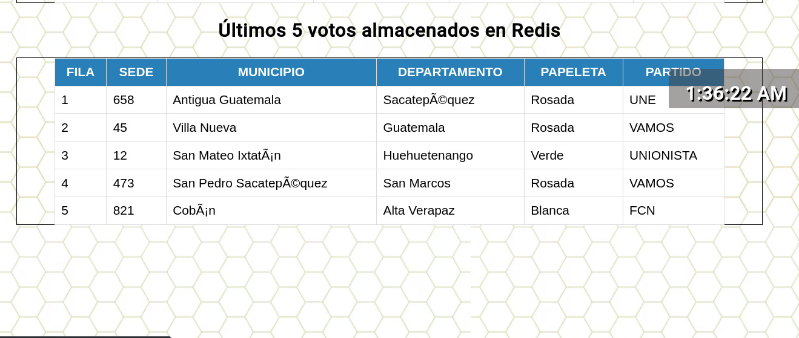

## Manual de Usuario

UNIVERSIDAD DE SAN CARLOS DE GUATEMALA

FACULTAD DE INGENIERIA

ESCUELA DE CIENCIAS Y SISTEMAS

---

## Integrantes

| Nombre   |      Carné      |
|----------|:-------------:|
| Alvaro Emmanuel Socop Pérez | 202000194 |
| Sergie Daniel Arizandieta Yol | 202000119 |

---

## Objetivos

### General
El documento tiene como finalidad proporcionar una guía del software con la cual puede conocer el manejo adecuado y correcto que la aplicación necesita para el funcionamiento de dicho programa.

### Específicos
- Otorgar al usuario una explicación grafica simple y concisa de entender todas las funcionalidades que el software posee de manera lógica y del mismo modo que simula los procesos requeridos.

- Entregar al usuario las indicaciones y pasos requeridos a seguir (un algoritmo) para que la simulación de la gestión de datos sea la adecuada y cumpla su función.

- Que todo usuario que utilice el software sea capaz de cumplirse con las finalidades de este.

---
### Descripción del programa
Se creó un sistema distribuido que mostraba estadísticas en tiempo real mediante Kubernetes y tecnologías en la nube. También se proporcionó un despliegue blue/green, es decir, una división de tráfico de entrada. Este proyecto fue aplicado para llevar el control sobre el porcentaje de votos emitidos en las elecciones.

---
## Requisitos del sistema

Instalar Un Navegador Web

---
## URL de la página web
[Página web](link1)

## Página web
Se desarrolló un frontend en React para visualizar la información de ambas bases de datos. La aplicación web solicita constantemente a la API los datos de ambas bases, que son desplegados en diferentes formatos según la solicitud. Estos formatos incluyen:

- Recopilación de datos almacenados en MySQL.
- Top 3 de departamentos con más votos para presidente en MySQL.
- Gráfico circular que muestra el porcentaje de votos por partido - según el municipio y departamento en MySQL.
- Gráfico de barras que muestra las 5 sedes con más votos - almacenados en Redis.
- Los últimos 5 votos almacenados en Redis.

Donde estos se podrán apreciar en una página web en la [URL](link1) indicada, para mayor compresión de los anterior se mostrara de forma gráfica el aspecto de la página en el navegador de Opera.

## Actualización de la Página web
Esta página web tiene una taza de refresco de 3 segundos, por lo cual podemos decir que esta página muestra datos en tiempo real, además de mostrar la fecha y hora de la consulta actual.

Este cambia según se le de click al aparatado gris trasparente para intercalar lo que se quiere ver:

### Recopilación de datos almacenados en MySQL.

Como se puede observar en la imagen esta es una tabla que posee todos los datos de la base de MYSQL, donde la misma tiene un scroll para poderse desplazar en toda la tabla ya que entre más tiempo este tenga ejecutándose la base de datos podría llegar a tener miles de datos, peor con la tabla se vuelve fácil de ver cada uno de los datos.

### Top 3 de departamentos con más votos para presidente en MySQL.

Este grafico muestra de una forma de premiación al top 3 de departamentos que han poseído más votos durante el transcurso de la aplicación, cabe resaltar que esta grafica es según los datos de MYSQL

### Gráfico circular que muestra el porcentaje de votos por partido según el municipio y departamento en MySQL.

Este grafico muestra una gráfica de PIE que permite visualizar de manera interactiva el porcentaje de votos por partido, donde tiene una opcionalidad para poder seleccionar si se desea ver departamento o municipio donde se pendiendo de esta opciones serán las siguientes opciones para poder ver uno en específico, teniendo las 2 opciones seleccionadas se podrá visualizar el grafo

### Gráfico de barras que muestra las 5 sedes con más votos - almacenados en Redis.

Este grafico muestra las 5 sedes dentro que tuvieron más concurrencia en las votaciones, siempre que estos sean almacenados en Redis, como se puede ver a continuación el delimitante de al grafica siempre será la sede que más datos tenga y teniendo como leyenda en el eje x es el número de sede y en eje y el numero de votos.

### Los últimos 5 votos almacenados en Redis.

Esta grafica mostrar los últimos 5 datos que fueron ingresados a Redis, donde se podrá visualizar todos los atributos de estos últimos datos.

  

**_Happy Coding!_**

